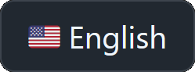
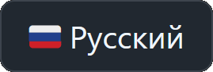
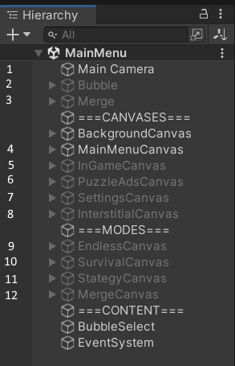

# JUST BUBBLES

 A casual 2D bubble shooter developed on Unity3D for the Yandex.Games platform.

  
Gameplay preview

  
  https://github.com/user-attachments/assets/a0745bc1-491d-48f3-abcb-c22e1d6ad5fd

You can try it here:
 

The build for **Win x86** and **Android ARMv7** is available [in the releases section.](https://github.com/Dan0398/JustBubbles/releases/tag/V1.2)

## Briefly:
- Unity3D 2022.3.10f1.
- Unity UI interface.
- Architecture based on Service Locator.
- Async/await via UniTask.
- Reactivity through its [set of Observable < T > scripts](/Assets/Scripts/Utils/Observable/).
- Animations via [EasingFunctions](/Assets/Scripts/EasingFunctions.cs).
- Music and sounds are delivered via Asset bundles, assembly via Asset Bundle Browser.
- Input via the (New) Input System.
- Localization via mine own plugin. I compiled it into a Dll and put it in the plugins folder so that the project could run in a third-party environment.

## Creation history
Initially, the project was done as a test task. Even [the repository has been preserved](https://github.com/Dan0398/BubbleShooter ). Later, I wanted to finish the project. After the publication (May 2023), I saw that users liked the project and decided to develop it. With each release of a new version, the game session time grew and grew. I stopped development because I couldn't keep coming up with ideas for this scale of the project. But all this time and to this day (February 2025), the project has been bringing in a pretty penny.

## Project and code structure
Entry points to the project:
- [Registrar](/Assets/Scripts/Services/DI/Registrar.cs). Registers services in the Service Locator from the start of the application. Due to the `[RuntimeInitializeOnLoadMethod]` attribute, startup does not require an object on the stage, and there is also a call to `Awake()` on the stage, which removes the need to wait for initialization.
- [Gameplay Controller](/Assets/Scripts/Gameplay/Controller.cs). It's hanging on the Main Camera (number 1 below). In fact, it switches game states, smoothly disabling the previous one.

The whole game takes place on one stage.
The project consists of 2 gameplay components: 
- Bubble shooter. The player's field and tools are number 2 in the hierarchy. [Field Component](Assets/Scripts/Gameplay/Field/BubbleField.cs). [Algorithm for finding neighboring loot inside the field](Assets/Scripts/Gameplay/Field/NeighborPlaces.cs). [Tools folder](Assets/Scripts/Gameplay/Instruments/)
- Merge. The field and tools are number 3 in the hierarchy. [Codebase folder](Assets\Scripts\Gameplay\Merge).

- 4 - canvas menu. 
- 5 canvas tools for bubble shooter (shot, bomb, laser and multishar). It is used in "endless" mode and "survival" mode.
- 6 - canvas advertising another puzzle app. 
- 7 - settings canvas. 
- 8 - Overlay with an ad timer, used in "infinite" mode and "merge".

Each game mode uses its own canvas. In the hierarchy it is:
- 9 for the infinite;
- 10 for survival;
- 11 for strategy and
- 12 for merger.

Hierarchy:

## Additional Information
Q: Why is the project uploaded in a single commit?
>A: I'd like to note that I don't do this anymore. 
>
>When I was first learning Git, I broke a couple of my projects midway through the development cycle. At that time, I decided to develop projects without Git, which seemed quite acceptable: I was developing alone and maintained backups on an external hard drive for safety.
>
>With work experience came the need to interact with colleagues. Now I use Git (or any other VCS) comfortably, try to create branches for features, and resolve merge conflicts. 

Q: I noticed that you don't like to write private in your code.
>A: Yes, I prefer to write like this in my own projects. But I want to emphasize that coding style is not crucial for me, I can easily adapt to the team's standards. 

Q: There are sections with commented-out code. The code is not always written neatly.
>A: This is part of the charm of this project. I'm showing it exactly as it was developed for the market. I sincerely believe that this is more or less normal for projects at release. However, I'm not averse to striving for cleanliness. 
