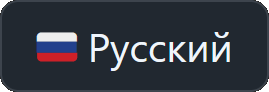

# JUST BUBBLES

 Казуальный 2D бабл-шутер, разработанный на Unity3D для платформы Яндекс.Игры.

  
Видео с геймплеем.

  
  https://github.com/user-attachments/assets/a0745bc1-491d-48f3-abcb-c22e1d6ad5fd

Попробовать можно здесь:
 

Билд для **Win x86** и **Android ArmV7** доступен [в разделе релизов.](https://github.com/Dan0398/JustBubbles/releases/tag/V1.2)

## Кратко:
- Unity3D 2022.3.10f1.
- Интерфейс Unity UI.
- Архитектура на Service Locator.
- Async/await через UniTask.
- Реактивщина через свой [набор скриптов Observable< T >](/Assets/Scripts/Utils/Observable/).
- Анимации через [EasingFunctions](/Assets/Scripts/EasingFunctions.cs).
- Музыку и звуки поставляются через Asset bundles, сборка через Asset Bundle Browser.
- Ввод через (New) Input System.
- Локализация через свой плагин. Я его собрал в Dll и поставил в папку plugins, чтобы проект мог запускаться в стороннем окружении.

## История создания
Изначально проект делал как тестовое задание. Даже [сохранился репозиторий](https://github.com/Dan0398/BubbleShooter). Позднее я захотел дописать проект. После публикации (май 2023) увидел, что пользователям проект понравился, решил развивать. С каждым выпуском новой версии время игровой сессии росло и росло. Разработку прекратил, т.к. я не мог дальше придумывать идеи для данного масштаба проекта. Но всё это время и по сей день (февраль 2025) проект свою копеечку приносит.

## Структура проекта и кода
Точки входа в проект:
- [Registrator](/Assets/Scripts/Services/DI/Registrator.cs). Регистрирует сервисы в Service Locator'е со старта приложения. Благодаря аттрибуту `[RuntimeInitializeOnLoadMethod]` запуск не требует объекта на сцене, а также происходит вызов до `Awake()` на сцене, что убирает необходимость дожидаться инициализации.
- [Gameplay Controller](/Assets/Scripts/Gameplay/Controller.cs). Висит на MainCamera (номер 1 ниже). По сути переключает игровые состояния, плавно отключая предыдущее.

Вся игра происходит на одной сцене.
Проект состоит из 2 геймплейных составляющих: 
- Бабл-шутер. Поле и инструменты игрока - номер 2 в иерархии. [Компонент поля](Assets/Scripts/Gameplay/Field/BubbleField.cs). [Алгоритм поиска соседних баблов внутри поля](Assets/Scripts/Gameplay/Field/NeighborPlaces.cs). [Папка с инструментами](Assets/Scripts/Gameplay/Instruments/)
- Слияние. Поле и инструменты - номер 3 в иерархии. [Папка с кодовой базой](Assets\Scripts\Gameplay\Merge).

- 4 - канвас меню. 
- 5 - канвас инструментов для бабл-шутера (выстрел, бомба, лазер и мультишар). Используется в "бесконечном" режиме и "выживании".
- 6 - канвас с рекламой другого приложения про пазлы. 
- 7 - канвас настроек. 
- 8 - Оверлей с таймером рекламы, используется в "бесконечном" режиме и "слиянии".

Каждый игровой режим пользуется своим канвасом. В иерархии это:
- 9 для бесконечного;
- 10 для выживания;
- 11 для стратегии и
- 12 для слияния.

Иерархия:

## Дополнительно

Q: Почему проект залит одним комитом?
>A: Сразу отмечу, что сейчас подобного не допускаю.
>
>На заре изучения Git в своё время сломал пару своих проектов на середине цикла разработки. Тогда решил, что проекты буду вести без git, что выглядело вполне сносно: разработку вёл один, а сохранность соблюдал бэкапами на внешний жёсткий диск.
>
>С опытом работы пришла необходимость взаимодействия с коллегами. Теперь Git'ом (или любой другой vcs) пользуюсь спокойно, стараюсь создавать ветки под фичи, а также разрешаю конфликты слияния.

Q: Заметил, что не любишь писать `private` в коде.
>A: Да, мне нравится так писать в **своих** проектах. Но хочу отметить, что стиль написания для меня не принципиален, спокойно подстроюсь под команду.

Q: Есть участки с закомментированным кодом. Код написан не везде аккуратно.
>A: В этом некоторая прелесть этого проекта. Я показываю его именно в таком виде, в котором он и разрабатывался для рынка. Искренне убеждён, что это +- нормально для проектов на релизе. Но стремление к чистоте мне не претит.
